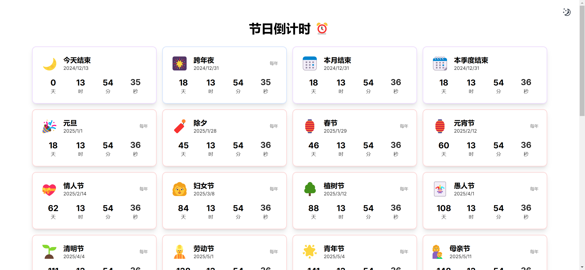

# Holiday Countdown
A beautiful and interactive holiday countdown web application built with Next.js 15, React 19, Radix UI, and TailwindCSS.

## Features
- 🎯 Single page application with beautiful countdown cards
- ✨ Interactive animations and effects for each holiday
- 🎨 Modern and responsive design using Radix UI
- 📅 Smart sorting - nearest holidays appear first
- 🎊 Special holiday-specific animations and icons
## Tech Stack
- Next.js 15
- React 19
- Radix UI
- TailwindCSS
- TypeScript
- PNPM (Package Manager)
## Getting Started
```bash
# Install dependencies
pnpm install
# Run development server
pnpm dev
# Build for production
pnpm build
# Start production server
pnpm start
```
## Development
The application is built with the latest web technologies and follows modern development practices. It uses:
- App Router for routing
- Server Components for improved performance
- Tailwind CSS for styling
- Radix UI for accessible components
- TypeScript for type safety